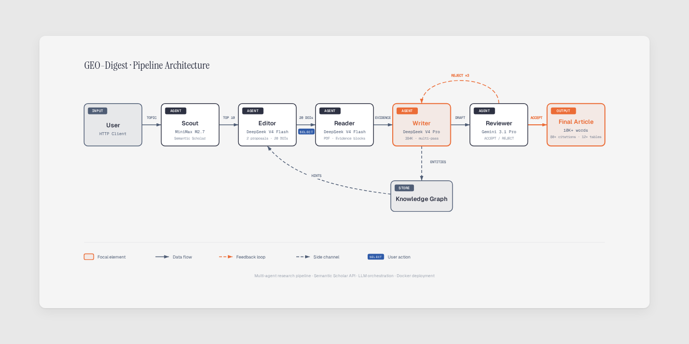
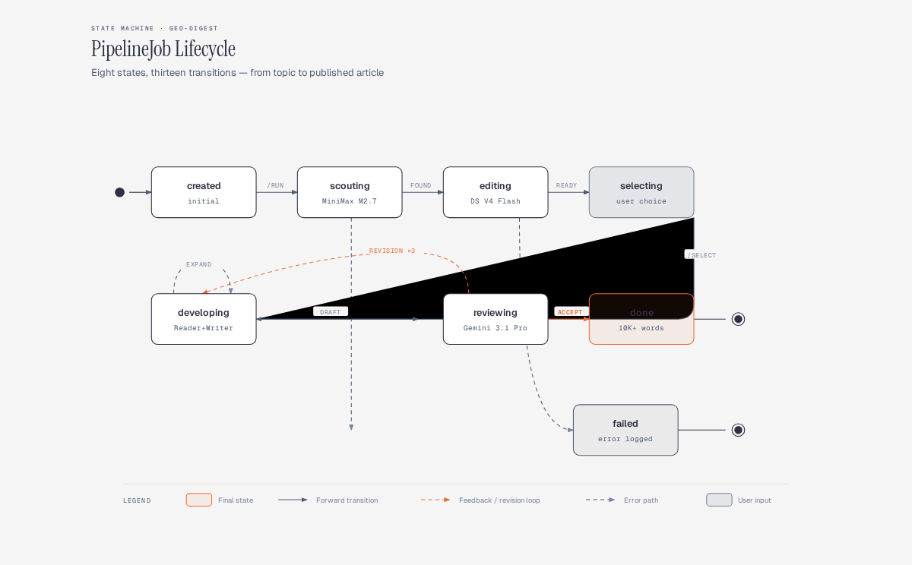

# GEO-Digest

**Geo-Ecology Research Intelligence Platform** — автономная multi-agent система для генерации полноценных обзорных научных статей по теме экологических и геологических исследований.

> Вводишь тему → система ищет статьи в Semantic Scholar → скачивает PDF → извлекает доказательства → пишет review-статью на 10 000+ слов с цитатами, таблицами и формулами.

---

## Pipeline Architecture



GEO-Digest реализует **5-агентный pipeline** с LLM-оркестрацией:

| Агент | Модель | Задача |
|-------|--------|--------|
| **Scout** | MiniMax M2.7 | Поиск статей в Semantic Scholar API, скоринг по гео-экологическим критериям |
| **Editor** | DeepSeek V4 Flash | Генерация research proposals (тема + вопросы + методология + 20 DOI) |
| **Reader** | DeepSeek V4 Flash | Скачивание PDF, извлечение evidence blocks (цитаты, данные, таблицы) |
| **Writer** | DeepSeek V4 Pro | Multi-pass написание статьи (outline → expand → expand short → references) |
| **Reviewer** | Gemini 3.1 Pro | Оценка качества (depth, citations, structure), вердикт ACCEPT / NEEDS_REVISION |

### Knowledge Graph

Система поддерживает **LeanKG** — knowledge graph на 1300+ элементов, построенный из извлечённых сущностей (методы, модели, датасеты, локации). Graph обогащает Editor hints'ами и Writer контекстом при написании.

---

## Pipeline Lifecycle



**8 состояний, 13 переходов:**

```
created → scouting → editing → selecting → developing → reviewing → done
                                        ↘                        ↙
                                         ←←← REVISION ×3 ←←←
```

1. **POST /pipeline/run** `{topic, group_type}` → создаёт job, запускает Scout
2. **Scout** ищет статьи (57+ статей по теме), скорит, возвращает top-10
3. **Editor** генерирует 2 proposal с 20 DOI каждый
4. **POST /select** `{proposal_id}` → пользователь выбирает proposal
5. **POST /develop** → Reader качает PDF, Writer пишет, Reviewer оценивает
6. Если **REJECT** → Writer переписывает (до 3 раундов, потом forced accept)
7. **done** → итоговая статья 10 000+ слов

---

## Writer Multi-Pass Architecture

Ключевой компонент — **Writer Agent** с multi-pass подходом:

```
Pass 1: Outline Generation
  → LLM генерирует структуру из 7 секций с paragraph descriptions
  → SECTION_TARGETS определяют min/max слов для каждой секции

Pass 2: Section-by-Section Expansion  
  → Каждая секция получает отдельный LLM call с evidence blocks
  → Writer получает полный контекст: outline + evidence + source articles

Pass 2b: Expand Short Sections
  → Проверка word count каждой секции
  → Секции ниже min target получают дополнительный LLM call для расширения

Pass 3: Assembly + References
  → Сборка секций в единый документ
  → Deduplication DOI в references (dict.fromkeys)
  → Встроенные цитаты [Author et al., Year]
```

**Результат:** статьи стабильно выходят на **10 000–11 000 слов** (σ = 4.3% по двум E2E прогонам).

---

## Структура репозитория

```
GEO-Digest/
├── worker/server.py              # Worker API (FastAPI, порт 3001)
├── dashboard/
│   ├── app.py                    # Dashboard proxy (FastAPI, порт 3000)  
│   └── templates/index.html      # Frontend (5 табов: Статьи/Исследование/Агенты/Граф/Статистика)
├── engine/
│   ├── orchestrator_v2.py        # Pipeline orchestrator (state machine)
│   ├── agents/
│   │   ├── scout.py              # Scout Agent — Semantic Scholar search
│   │   ├── editor.py             # Editor Agent — proposal generation
│   │   ├── reader.py             # Reader Agent — PDF → evidence extraction
│   │   ├── writer.py             # Writer Agent — multi-pass article writing
│   │   └── reviewer.py           # Reviewer Agent — quality scoring
│   ├── llm/
│   │   ├── config.py             # LLM provider configuration
│   │   └── openai_compat.py      # OpenAI-compatible API client (retry, streaming)
│   ├── prompts/
│   │   ├── writer_prompts.py     # SECTION_TARGETS, prompt builders
│   │   └── editor_prompts.py     # Proposal generation prompts
│   ├── scoring.py                # Article scoring engine
│   ├── schemas.py                # Data schemas (Article, PipelineJob, etc.)
│   └── fetcher.py                # PDF downloader (Scrapling 2-tier)
├── tests/                        # 307 tests (7 pre-existing failures)
├── docs/
│   └── diagrams/                 # Architecture + state machine diagrams
├── Dockerfile.worker
├── Dockerfile.dashboard
├── docker-compose.yml
└── AGENTS.md                     # Project constitution
```

---

## API Endpoints

### Pipeline API (основной интерфейс)

| Method | Endpoint | Описание |
|--------|----------|----------|
| `POST` | `/api/pipeline/run` | Запуск pipeline (Scout + Editor) |
| `GET` | `/api/pipeline/jobs` | Список всех jobs |
| `GET` | `/api/pipeline/jobs/{id}` | Статус конкретного job |
| `DELETE` | `/api/pipeline/jobs/{id}` | Удалить job |
| `POST` | `/api/pipeline/jobs/{id}/select` | Выбрать proposal |
| `POST` | `/api/pipeline/jobs/{id}/develop` | Reader + Writer + Reviewer |
| `POST` | `/api/pipeline/jobs/{id}/write` | Только Writer |
| `POST` | `/api/pipeline/jobs/{id}/review` | Только Reviewer |
| `GET` | `/api/pipeline/jobs/{id}/export` | Экспорт статьи |

### Article API

| Method | Endpoint | Описание |
|--------|----------|----------|
| `GET` | `/api/a/articles` | Все статьи в storage |
| `GET` | `/api/a/article/{id}` | Статья по ID |
| `GET` | `/api/a/stats` | Статистика storage |
| `GET` | `/api/a/topics` | Список тем |

---

## Deploy

```bash
# Docker Compose (v2.36.1+)
docker compose build
docker compose up -d

# Dashboard: http://localhost:3000
# Worker API: http://localhost:3001
```

### Environment (.env)

```env
OPENROUTER_API_KEY=sk-or-...      # Writer (DeepSeek V4 Pro), Editor, Reader
MINIMAX_API_KEY=...                # Scout (MiniMax M2.7)
GOOGLE_API_KEY=...                 # Reviewer (Gemini 3.1 Pro)
SEMANTIC_SCHOLAR_API_KEY=...       # Article search (optional, higher rate limits)
```

### Обновление engine (без rebuild)

```bash
docker cp engine/ geo-digest-worker:/app/
docker compose restart worker
```

---

## E2E Validation

Два полных прогона с нуля (Scout → Editor → Select → Develop → Review):

| Метрика | Run 1 (PINN) | Run 2 (Earthquake) |
|---------|-------------|-------------------|
| **Слов** | 10 256 | 10 876 |
| **Секций** | 7 | 7 |
| **Цитат** | 94 | 79 |
| **Математических выражений** | 34 | 44 |
| **Таблиц** | 12 | 8 |
| **References** | 10 | 20 |
| **Pipeline время** | ~18 мин | ~18 мин |

---

## Tech Stack

| Компонент | Технология |
|-----------|-----------|
| Backend | Python 3.12, FastAPI |
| LLM Provider | OpenRouter (DeepSeek V4 Pro/Flash, Gemini 3.1 Pro, MiniMax M2.7) |
| Article Search | Semantic Scholar API |
| PDF Processing | Scrapling (2-tier fetch), pdfminer |
| Knowledge Graph | LeanKG (1300+ elements, 1675 relationships) |
| Semantic Search | Semble (minishlab/potion-base-8M) |
| Frontend | Vanilla JS, Cytoscape.js (graph tab) |
| Deploy | Docker Compose (2 containers: Dashboard + Worker) |
| CI | pytest (307 tests) |

---

## License

MIT
